# Instructions for build set up

This document will define the steps taken to deploy the web application.

## Configure Vagrant, Packer and Terraform

Prerequisites require that Vagrant and Packer be set up prior to this tutorial. Using the secret tokens and variables provided, follow these additional [tutorials](https://github.com/illinoistech-itm/jhajek/tree/master/itmt-430/IT-Operations-cloud-connect-tutorial) to connect to the host ITMT430 server (192.168.172.0/24).

## Build Server

The build server is only accessible through VPN or local connection on campus. To connect, use the given username and password provided to you via email from Hajek and login as usual. A successful connection is shown here:

### Keygen

You are now able to SSH into the server via your console or terminal. Using the command `ssh -i path-to-private-key USERNAME@system44.rice.it.edu`, enter the build server. Upon inital opening, you will need to create an additional SSH key for app cloning. Use `ssh-keygen -t ed25519` to generate a new key, with the name "id_ed25519_buildserver_github_key" - remember where you put it as it will be needed for the GitHub key. Open the public key using cat to reveal the public key we need to insert into GitHub. Copy the contents, then go to the team repo on GitHub using your web browser, settings, then to SSH and GPG keys. Insert the public key, name it something related to the build server so you don't forget! 

### Config

Now we need to make a config file to access GitHub from our build server. To make a config file in our home directory, use the command `vim ~/.ssh/config`. Edit the file to match the contents below, changing the variables to match your GitHub account name and key. If you did not name your key this, change it to the name you chose. 

Now to connect, run `ssh git@github.com` - it should say you've been successfully authenticated. You are now able to clone the repo. Using `git clone https://github.com/illinoistech-itm/team-6o-2023.git`, execute this once. This will allow you to pull any updates from the repository. 

### Packer

Packer is used to create virtual machine templates for our deployment. To use Packer, we will change a few variables for our application. Go to the team-6o repo /build/example-code/packer/proxmox-jammy-ubuntu-front-back-template directory. Here we will see template-for-variables.pkr.hcl, which name must be changed to variables.pkr.hcl. Using the tokens and secrets provided to you (check email and Discord), insert them in the appropriate places. 

Then, go to the subiquity/http directory and locate template-user-data as it will need to be changed to user-data. We will need to generate another key for line 56 in user-data. Move to the proxmox-jammy-ubuntu-front-back-template directory and execute `ssh-keygen -t ed25519` with the name "./id_ed25519_packer_terraform_key" so it stays in this directory. We want to copy the public key for user-data, so using cat, copy over the contents to line 56. This will allow us access to any instances we make. It should look like this:

Next, you will need to copy your config and build server key (first key we generated) over to the proxmox-jammy-ubuntu-front-back-template directory so Packer can locate it for the app cloning during the build. To copy, go to your ~/.ssh directory, then use the command `cp config id_ed25519_buildserver_github_key ~/team-6o-2023/build/example-code/packer/proxmox-jammy-ubuntu-front-back-template`. Then move to that desired directory and use `vim config` as we need to edit it to add StrictHostKeyChecking and the path of the Identityfile.

Your directory should look like this:

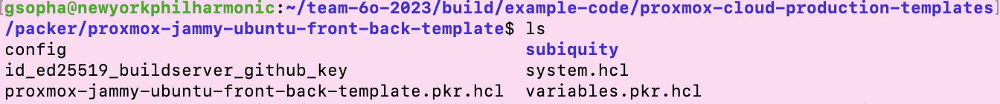

Once you've done so, run `packer init .` if it's the first time to grab any dependencies. Then, `packer validate .`to ensure configuration is valid. Sometimes when pulling updates, files will duplicate since we changed the names and added it to our gitignore. Simply remove the template files, or the configuration will not validate.

If yes, proceed with `packer build .` and allow for 20-40 minutes of build time. Once successful, you will see this in the Proxmox console at https://system41.rice.iit.edu:8006 (login using given username and password). To delete old VMs, click the desired one within the console and go to more in the top right corner. Choose remove and check both boxes. Whenever the Packer data is updated it MUST be deleted via console before rebuilding the new with code.

### Terraform

Terraform will deploy our web app to resolved addresses on the build server. Like Packer, we must change some variables and file names before executing. Go to /build/example-code/proxmox-cloud-production-templates/terraform/proxmox-jammy-ubuntu-front-back-template directory and find template-terraform.tfvars and change its name to terraform-tfvars. Again, refer to the email and Discord secrets provided for this file. 

Now we want to copy over the key we created called id_ed25519_packer_terraform_key to the terraform/proxmox-jammy-ubuntu-front-back-template directory. Go back to build/example-code/packer/proxmox-jammy-ubuntu-front-back-template and from there use the command `cp id_ed25519_packer_terraform_key ../../terraform/proxmox-jammy-ubuntu-front-back-template`. Verify that the key has been copied to the desired directory.

If it is the first time building, use `terraform init`. Then `terraform validate`, and if that command if valid, you can run `terraform apply`. If it is successful after about 10 minutes, there will be an output of the resolved addresses to the front and back end. We can SSH into these VMs by using `ssh -i id_ed25519_packer_terraform_key vagrant@ADDRESS`

To destroy or delete the deployment, use `terraform destroy` and allow around 5 minutes after the destroy before using `terraform apply` again. Note that there should be a 1:1 match from Packer to Terraform since Terraform is cloning the Packer VMs (in case you change any specs/variables) - refer to the tutorials at the beginning. 

### Scripts

Core-jammy and jammy-services scripts located in build/example-code/proxmox-cloud-production-templates/packer/scripts/proxmox/ are used to build the operating system, which is Ubuntu Server 22.04. 

Frontend scripts located in build/example-code/proxmox-cloud-production-templates/packer/scripts/proxmox/frontend are used to:
- Open firewalld ports 80, 443, and 3000 for Nginx and public server
- Install Nginx, Nodejs, npm
- Clone team repo
- Insert credential secrets (Google API)
- Start web server

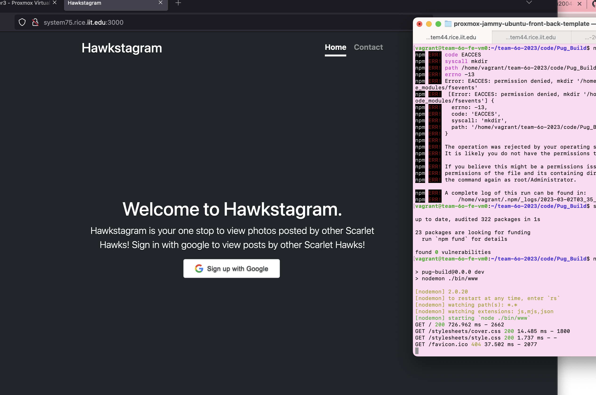

Backend scripts located in build/example-code/proxmox-cloud-production-templates/packer/scripts/proxmox/backend are used to:
- Open firewalld port 3306 for MariaDB
- Install MariaDB
- Clone team repo
- Insert username and password for database
- Create and autoinject database

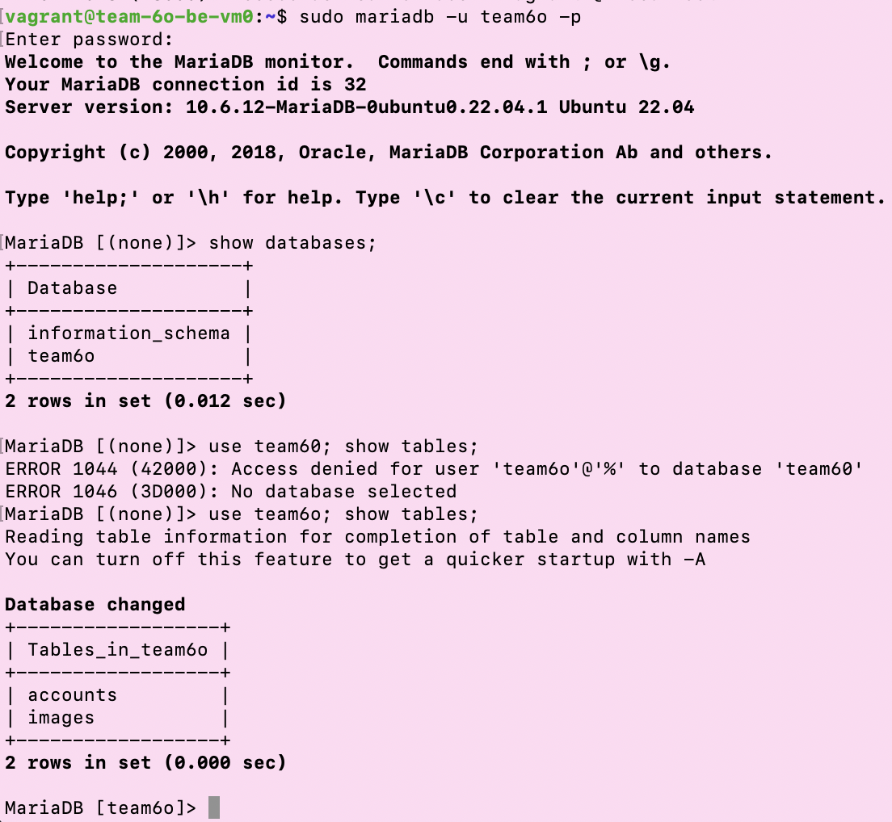

## Hashicorp Vault Tutorial

**NOTE:** You must complete Grace's tutorial before starting this tutorial. On top of that, go through Professor Hajek's Vault tutorial. Otherwise, this tutorial will make zero sense. 

1. First, SSH into our project build server using your account and public Id. 
- Your file path will look different depending on where you store your public ID.
- Use the same format as me, but replace my credentials with your credentails.

If your login is successful, the following output will appear:

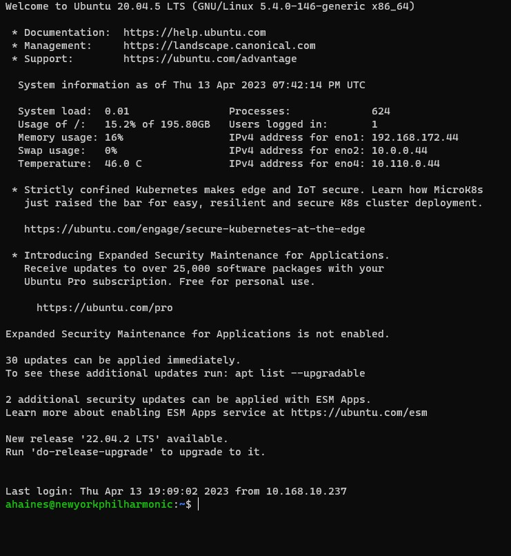

2. Type: `cd team-6o-2023/`. Press Enter.

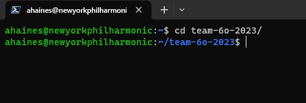

3. Type: `cd build/`. Press Enter.

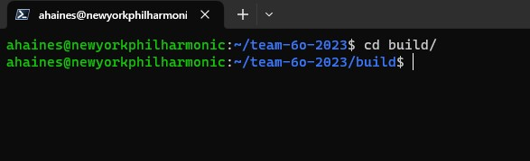

4. Type: `cd example-code/`. Press Enter.

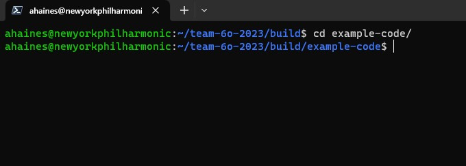

5. Type: `cd proxmox-cloud-production-templates/`. Press Enter.

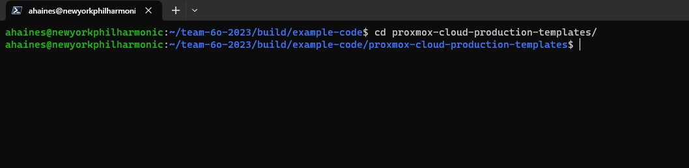

6. Type: `cd packer/`. Press Enter.

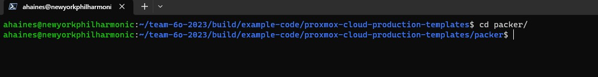

7. Type: `cd proxmox-jammy-ubuntu-front-back-template/`. Press Enter.

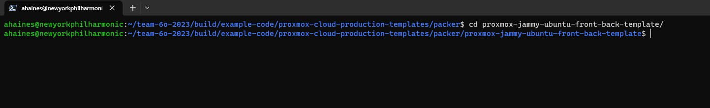

8. Type: `ls`. Press Enter. To check the contents of the selected directory.

- The `ls` command will show all contents of the current selected directory (folder).

**NOTE** : The contents of the directory should match the screenshot below.

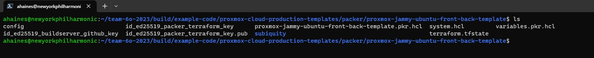

9. Connect to our vault server with the following command: `ssh -i id_ed25519_packer_terraform_key vagrant@192.168.172.80`. Press Enter.

The follow output should display if you the login is succesful:

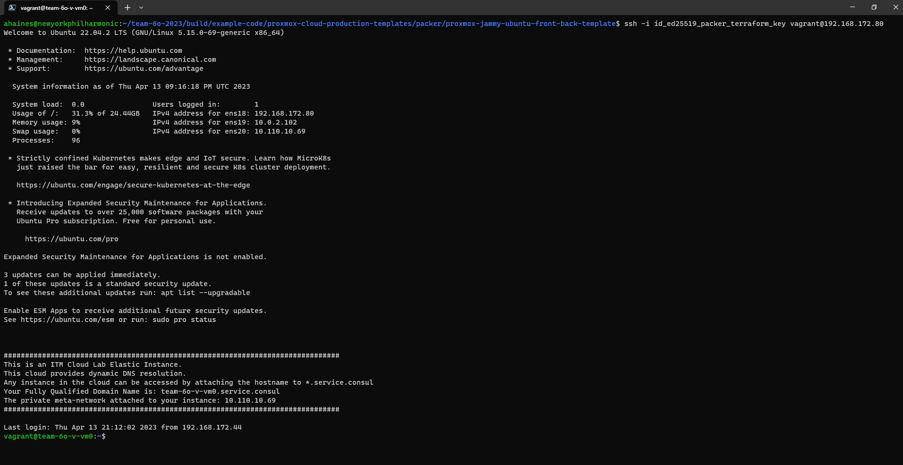

10. Type: `vault login`. Press enter.

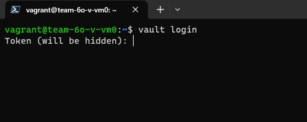

Insert the Non-root Vault Token you were given. Press Enter. 

The Following Output should display. Showing the amount of time your token will still be valid, the token you used, and the policies and permissions you are granted. For security reasons, I crossed out the token information. 

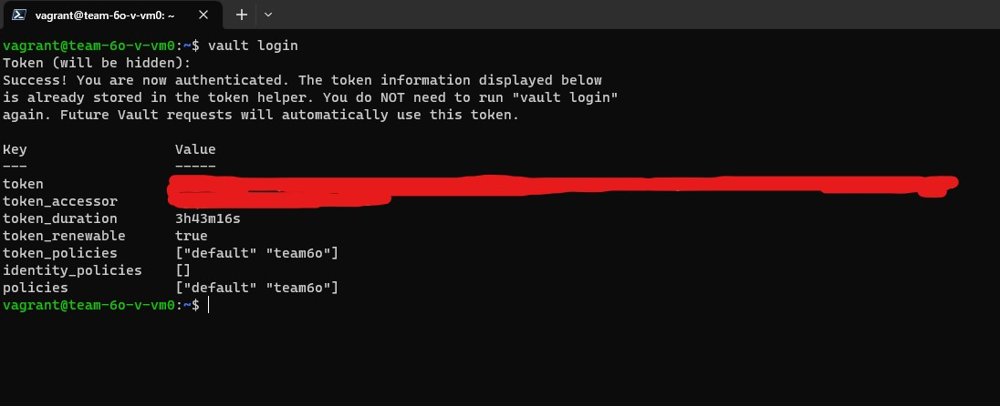

11. Now that you are logged in, type: `ls`. Press enter. You will now see the contents of our vault server. 

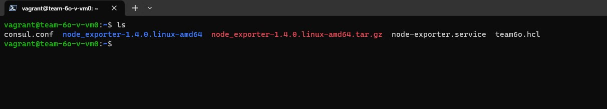

### Adjusting the Vault policy

12. Find team6o.hcl. This is our team's policy file. To view and update the policy file, type `nano team6o.hcl`. Press enter. If you entered the command correctly, this is what you should see:

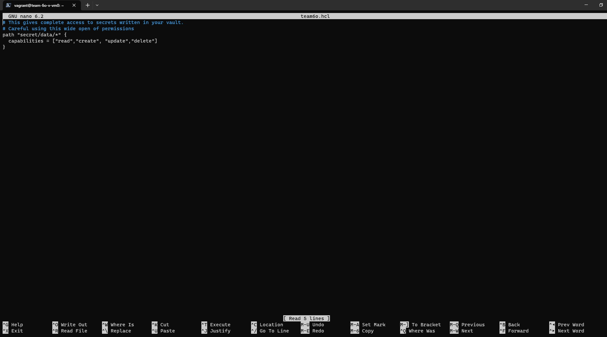

Not that we need to, but if you add anything to the project policy, ensure that you save your changes. To do this, press `ctrl + O`. To exit the file, press `ctrl + X`.

### Inserting/Viewing Vault Secrets
13. To view secrets, type `vault kv get -mount=secret name-of-secret` Press enter. 

To view the current secrets of our vault, type the following commands. 

First, type `vault kv get -mount=secret team6o-db` for database secrets. 
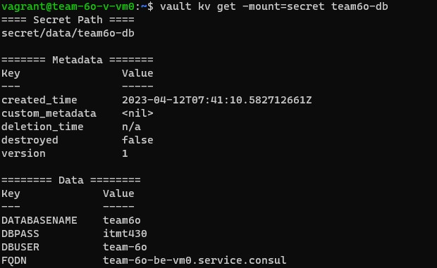

Second, type `vault kv get -mount=secret team6o-ssh` to get our ssh secret.
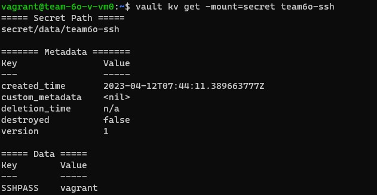

If you add any other secrets. Make sure insert how to view them within this tutorial.

14. To insert a secret, use the following command. Type: `vault kv put -mount=secret name-of-secret desired-variables-for-secret`. 

15. Now that you have added secrets to vault, exit our vault server. 
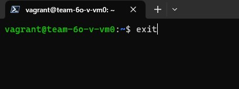

